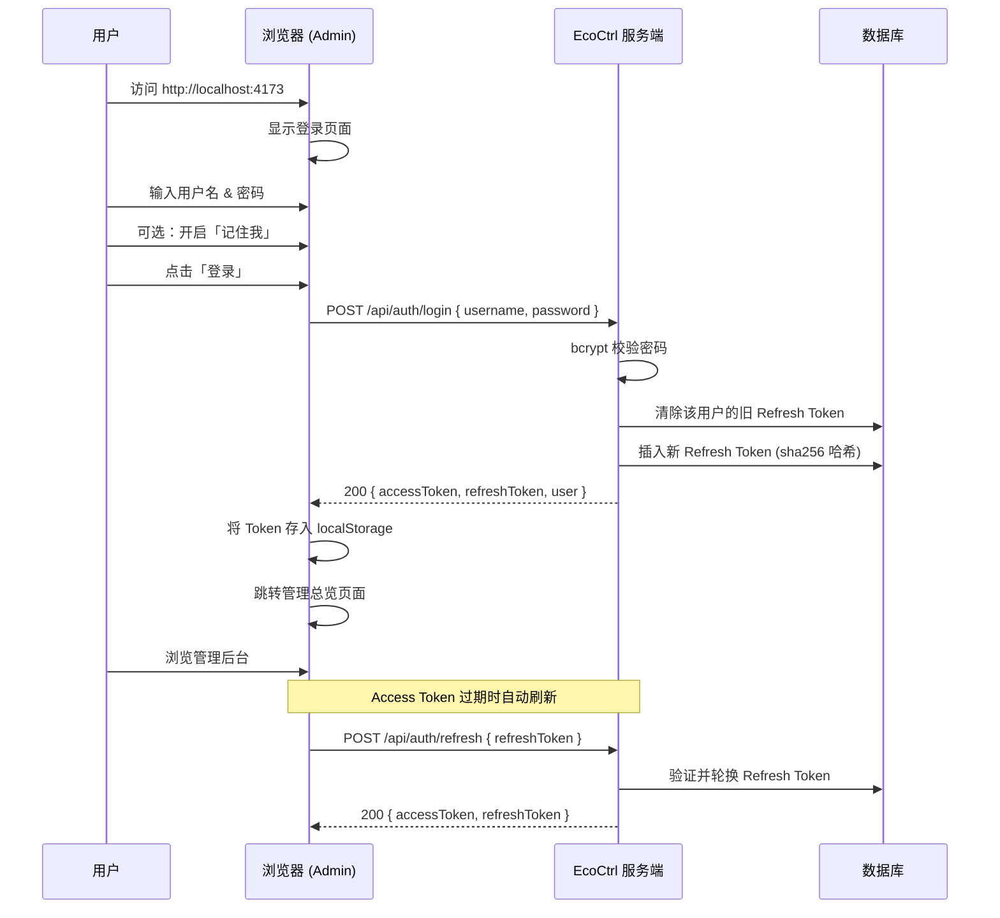

# 登录与账户访问

EcoCtrl 平台提供多种登录方式，支持账号密码、邮箱验证码、OAuth 第三方登录。本文将逐一介绍每种方式的操作步骤及注意事项。

---

## 登录

访问 Admin 后台地址（默认 `http://localhost:4173`），即可看到登录页面。

**操作步骤：**

1. 在浏览器中打开 `http://localhost:4173`。
2. 输入用户名和密码。
3. 根据需要开启「记住我」开关（详见下文）。
4. 点击「登录」按钮。
5. 登录成功后自动跳转到管理总览页面。

**首次部署：**

- 默认管理员账号：`admin`
- 初始密码由以下两种方式之一决定（优先级从上到下）：
  - `INIT_ADMIN_PASSWORD` 环境变量指定
  - 运行 `pnpm db:seed` 时输出的初始密码
- 首次登录后建议立即修改密码。

**记住我：**

「记住我」开关控制会话的持久化时长。开启后，Refresh Token 的有效期将延长，减少因 Token 过期而需要频繁重新登录的情况。关闭时，会话在浏览器关闭或 Token 过期后自动失效。具体有效期配置可参考服务端运维文档。

**登录流程：**

---

## 注册新账户

登录页面底部提供「注册新账户」切换链接，点击后进入注册模式。

**操作步骤：**

1. 在登录页底部点击「注册新账户」。
2. 填写以下信息：
   - **用户名**：登录时使用的账号名称。
   - **邮箱**：用于接收验证码和后续找回密码。
   - **验证码**：点击「发送验证码」，6 位数字码将发送至填写的邮箱。
   - **密码**：设置登录密码。
   - **确认密码**：再次输入密码以确认。
3. 点击「注册」按钮。

**注意事项：**

- 验证码通过 SMTP 邮件发送，有效期为 **5 分钟**。请在收到后尽快填写。
- 未收到验证码时，可检查邮箱垃圾箱或稍后重试发送。
- 每个验证码只能使用一次，使用后立即失效。
- 注册成功后自动登录，无需再次输入密码。
- 新账户的默认角色为 **`viewer`**（只读权限）。如需提权，请联系管理员在 Admin 后台用户管理页面操作。

---

## 忘记密码

如果忘记登录密码，可通过邮箱验证码重置密码。

**操作步骤：**

1. 在登录页面点击「忘记密码」链接。
2. 输入注册时使用的邮箱地址。
3. 点击「发送验证码」，6 位数字码将发送至该邮箱。
4. 在页面中输入收到的验证码。
5. 输入新密码并确认。
6. 点击「重置密码」完成操作。

**关于会话：**

- 密码重置成功后，当前设备上的登录状态在 Access Token 有效期内仍然可用。
- Access Token 过期后，由于密码已变更，系统将无法签发新的 Token，届时需要使用新密码重新登录。
- 如需在所有设备上立即下线，管理员可在服务端清除该用户的 Refresh Token 记录。

---

## OAuth 登录

当服务端已配置 OAuth Provider 时（当前支持 **微信** 和 **飞书**），登录页面会增加对应的第三方登录按钮。

**首次使用 OAuth：**

首次使用 OAuth 登录时，需要将第三方身份与 EcoCtrl 账户绑定。绑定流程分为两种情况：

| 情况              | 操作                                                 |
| ----------------- | ---------------------------------------------------- |
| 已有 EcoCtrl 账户 | 登录后选择「绑定 OAuth」，将第三方账号与现有账户关联 |
| 尚无 EcoCtrl 账户 | 在 OAuth 授权后引导注册新账户，同时完成绑定          |

**绑定后的效果：**

- 一个 EcoCtrl 账户可以同时绑定多个 OAuth Provider。
- 绑定后，用户既可以使用 **账号密码** 登录，也可以使用 **OAuth** 登录。
- 无论通过哪种方式登录，最终访问的都是同一个用户账户和数据。

**操作步骤：**

1. 在登录页面点击对应的 OAuth 按钮（如「微信登录」或「飞书登录」）。
2. 浏览器弹出 Provider 授权窗口。
3. 在 Provider 页面完成身份确认。
4. 授权窗口自动关闭，页面完成登录。

**配置要求：**

OAuth Provider 需要在服务端配置凭据后方可使用。具体配置项（`WECHAT_APPID`、`WECHAT_SECRET`、`FEISHU_APPID`、`FEISHU_SECRET`）在 `packages/server/.env.local` 中设置。未配置的 Provider 不会在登录页显示。

---

## 三种界面模式

EcoCtrl 提供三种不同的界面模式，分别面向管理操作、数据可视化和公开访问。

### Admin 管理后台

- 访问地址：`http://localhost:4173`
- 登录后进入 Tab 式控制面板。
- 包含用户管理、设备管理、数据查询、系统设置等核心管理功能。
- 需要登录才能访问。

### Web 3D 驾驶舱

- 独立入口，提供能源数据的 3D 可视化展示。
- 支持 **匿名访问**：公开仪表盘无需登录即可查看。
- 如需要查看更详细的数据或操作，也可使用账户登录。

### 登录前可访问的页面

以下页面在未登录状态下即可访问：

| 页面           | 说明                      |
| -------------- | ------------------------- |
| Web 公开仪表盘 | 无需登录查看公开能源数据  |
| 登录页         | 账号密码 / OAuth 登录入口 |
| 注册页         | 创建新账户                |
| 忘记密码       | 密码重置流程              |

---

## 常见问题

**问：登录后无法跳转？**

检查浏览器是否禁用了 `localStorage`。系统需要 `localStorage` 存放 Token。

**问：注册时收不到验证码？**

- 确认邮箱地址填写正确。
- 检查邮箱垃圾箱。
- 确认服务端已正确配置 SMTP 发送服务。
- 单个邮箱发送频率可能受限，等待 1 分钟后重试。

**问：OAuth 按钮没有显示？**

说明服务端未配置对应 OAuth Provider 的凭据，请联系系统管理员配置。

**问：密码重置后旧设备还能登录吗？**

旧设备上的当前会话在 Access Token 有效期内仍然可用。Access Token 过期后需要重新登录。如需强制所有设备下线，请联系管理员。
