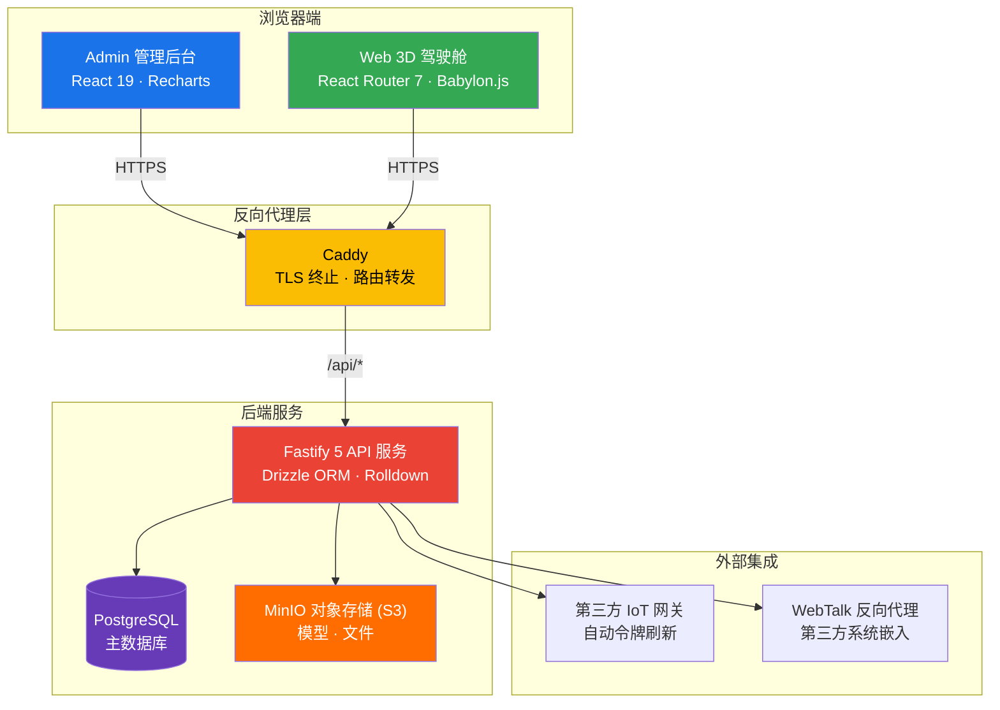

# 平台概述

## 什么是 EcoCtrl

EcoCtrl 是一个**能源与 IoT 控制平台**，将 3D 建筑可视化门户、实时监控管理后台、REST API 后端以及工作流自动化引擎整合在统一的 pnpm monorepo 中。

平台包含**两大前端入口**，分别面向不同使用场景：

| 入口                    | 技术栈                                       | 定位                                                                                              |
| ----------------------- | -------------------------------------------- | ------------------------------------------------------------------------------------------------- |
| **Admin 管理后台**      | React 19 + Recharts + TailwindCSS v4         | 功能全面的 Tab 式管理面板，面向运营团队和管理员，覆盖用户、模型、能源、故障、维保、报表与系统配置 |
| **Web 3D 可视化驾驶舱** | React Router 7 + Babylon.js + TailwindCSS v4 | 以 3D 建筑场景为核心的公共门户，面向访客和操作员，支持楼层漫游、热点标签与实时数据叠加            |

## 高层架构

以下架构图展示了平台的整体拓扑与数据流向：

**关键设计原则**：所有前端应用统一使用 `/api` 前缀访问后端。实际后端主机地址由开发模式下的 Vite 代理或生产环境中的 Caddy 在运行时改写，**修改 API 地址无需重新构建前端**。

## 核心能力全景

| 能力领域           | 说明                                                                                              | 面向用户               |
| ------------------ | ------------------------------------------------------------------------------------------------- | ---------------------- |
| **3D 建筑可视化**  | Babylon.js 驱动的交互式 3D 场景，支持多楼层漫游、热点标签、辉光效果与可配置自动旋转相机           | 所有用户               |
| **实时监控**       | 通过 Server-Sent Events (SSE) 推送能耗数据、设备故障与 IoT 状态变化，结合 Recharts 实现可视化分析 | 运营操作员、维保人员   |
| **统一管理后台**   | Tab 式导航面板，覆盖用户管理、数据模型、能源管理、故障管理、维保管理、报表系统与平台配置          | 系统管理员、运营操作员 |
| **工作流自动化**   | 可视化 DAG 工作流编辑器，支持定时触发、Webhook 触发与事件触发，内置插件系统支持自定义节点         | 运营操作员、开发者     |
| **IoT 设备集成**   | 透明网关代理模式，自动管理第三方 IoT 接口的令牌刷新与重连，提供类型化的设备数据接入               | 开发者、系统管理员     |
| **AI 智能助手**    | Screen Pet 对话式助手，支持自然语言交互与语音输入，可辅助查询能耗、故障与设备状态                 | 所有用户               |
| **第三方系统集成** | WebTalk 反向代理模块，支持将第三方 Web 系统以 iframe 方式嵌入 EcoCtrl 界面，实现统一工作台        | 系统管理员、开发者     |
| **报表与数据导出** | 定时报表计划、多维度能耗统计报表、碳排放因子管理、支持 PDF / Excel 导出                           | 能源管理员、运营操作员 |

## 适用角色

不同角色的典型工作场景如下：

### 系统管理员

管理平台的用户体系、访问权限与全局配置。负责用户创建与角色分配、系统参数维护、OAuth / SMTP 等服务配置，以及安全审计日志的审查。

### 运营操作员

日常使用最频繁的角色。通过 Admin 后台监控仪表盘查看能耗趋势与实时告警；通过工作流编辑器配置自动化任务（如定时报表、设备联动）；处理故障告警并进行初步处置。

### 能源管理员

关注建筑各分区的能耗情况与碳排放指标。使用能源管理模块查看分区能耗趋势、管理碳排放因子、生成对标分析报表，为节能优化提供数据支撑。

### 维保人员

负责设备的实时故障监控与维保管理工作。通过实时告警面板及时发现异常，调取维保说明书进行现场处置，记录维修历史。

### 开发者

通过 REST API 与平台集成，扩展现有功能或在 WebTalk 框架下开发子系统插件。API 覆盖认证、数据模型、能源、IoT 事件、报表导出等全部业务领域。

## 接下来去哪里

根据你的角色和需求，选择以下入口开始使用：

| 如果你是...          | 建议从这里开始                                                             |
| -------------------- | -------------------------------------------------------------------------- |
| 第一次访问平台的用户 | → [登录与账户访问](./login-auth) 了解如何登录、注册与绑定 OAuth            |
| 运营操作员 / 管理员  | → [Admin 管理总览](../dashboard/admin-overview) 查看仪表盘功能概览         |
| 想体验 3D 可视化     | → [Web 3D 建筑驾驶舱](../dashboard/web-3d) 了解 3D 场景操作                |
| 需要配置工作流       | → [工作流管理概览](../workflows/overview) 入门工作流自动化                 |
| 开发者 / 系统集成    | → [整体架构概览](/reference/architecture/overview) 了解技术架构与 API 路由 |
| 准备部署上线         | → [系统要求与前提条件](/deployment/requirements) 查看部署指南              |

## 技术栈一览

| 层级              | 技术栈                                          | 用途                                        |
| ----------------- | ----------------------------------------------- | ------------------------------------------- |
| `apps/web`        | React Router 7 + Babylon.js + TailwindCSS v4    | 公共 3D 门户 — 楼宇视图、楼层、系统、分析   |
| `apps/admin`      | React 19 + Recharts + TailwindCSS v4            | 内部管理后台 — 账号、设备、模型、报表、设置 |
| `apps/docs`       | VitePress 2                                     | 当前文档站点                                |
| `packages/server` | Fastify 5 + Drizzle ORM + PostgreSQL + Rolldown | REST API 与 IoT 网关代理                    |
| `packages/ui`     | React + Base UI + TailwindCSS v4                | 共享组件库（shadcn/ui 风格）                |
| `packages/shared` | Zod + TypeScript                                | 共享 schema、类型与 Vite 工具               |

> 还在寻找更多信息？查阅完整的 **用户指南** 与 **技术参考** 文档，或通过搜索功能查找关键词。
