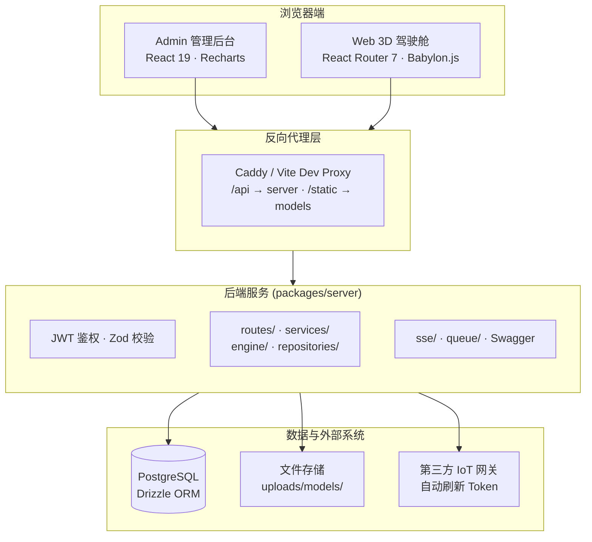

# 整体架构概览

## 高层架构图



## Monorepo 结构

EcoCtrl 采用 pnpm workspace monorepo，根目录下包含 `apps/` 和 `packages/`：

```
ecoctrl/
├── apps/
│   ├── admin/          # React 19 SPA 管理后台
│   ├── web/            # React Router 7 + BabylonJS 3D 公共门户
│   └── docs/           # VitePress 2 文档站点
├── packages/
│   ├── server/         # Fastify 5 后端 API 服务
│   ├── ui/             # shadcn/ui 组件库（源码分发）
│   └── shared/         # 共享 Zod Schema、Vite 配置、工具函数
├── docker/             # Docker Compose 部署配置
└── ...
```

## 技术栈

| 层级       | 技术                                      | 说明                      |
| ---------- | ----------------------------------------- | ------------------------- |
| 前端 Admin | React 19 + TypeScript + TailwindCSS v4    | 内部管理界面              |
| 前端 Web   | React Router 7 + BabylonJS 9 + TypeScript | 公共 3D 门户              |
| 后端       | Fastify 5 + TypeScript                    | RESTful API 服务          |
| 数据库     | PostgreSQL 16 + Drizzle ORM               | 关系型数据库              |
| 实时通信   | Server-Sent Events (SSE)                  | 服务端推送到客户端        |
| 任务队列   | pg-boss                                   | PostgreSQL 驱动的后台任务 |
| AI         | Anthropic Claude / OpenAI                 | AI 对话与工具调用         |
| IoT        | BACnet 网关代理                           | 第三方物联网设备接入      |
| 缓存       | 无独立缓存层（直接查询 PostgreSQL）       | —                         |

## 请求生命周期

一次典型的 API 请求经过以下路径：

```
1. 浏览器发送请求到 /api/xxx
2. Caddy / Vite Dev Proxy 根据前缀 /api 改写目标地址
3. Fastify 接收请求
   ├── onRequest 钩子：校验 JWT（public routes 白名单放行）
   ├── Zod 校验：body / querystring / params
   ├── 路由处理器：
   │   ├── 调用 repository 层（数据库操作）
   │   ├── 或调用 service 层（IoT 代理、邮件发送等）
   │   └── 或调用 engine 层（工作流执行）
   └── 响应返回
4. Caddy 将响应转发回浏览器
```

## 部署模式

### 本地开发

```
node tsx --watch  ──►  Fastify (localhost:3000)
vite-plus dev     ──►  Admin (localhost:5173)
vite-plus dev     ──►  Web   (localhost:8080)
vitepress dev     ──►  Docs  (localhost:5174)
```

Vite Dev Proxy 自动将 `/api` 和 `/static` 前缀转发到后端。

### Docker Compose

```
postgres:16-alpine        :5432
ecoctrl-server (Node)     :3000
ecoctrl-admin (Caddy)     :4173  → /api /static 重写至 http://server:3000
ecoctrl-web   (Caddy)     :8081  → /api /static 重写至 http://server:3000
```

前端 bundle 始终请求字面量 `/api` 和 `/static` 前缀。代理层负责改写目标地址。修改后端主机或前缀属于运行时配置变更，无需重新构建。

## 构建流水线

| 包                               | 工具                  | 输出                                            |
| -------------------------------- | --------------------- | ----------------------------------------------- |
| `apps/web`、`apps/admin`         | `vp build` (Rolldown) | 静态 SPA bundle                                 |
| `packages/server`                | `rolldown`            | `dist/index.mjs` + 自动生成 `dist/package.json` |
| `apps/docs`                      | `vitepress build`     | `.vitepress/dist/` 静态站点                     |
| `packages/ui`、`packages/shared` | 源码分发              | 不适用                                          |
