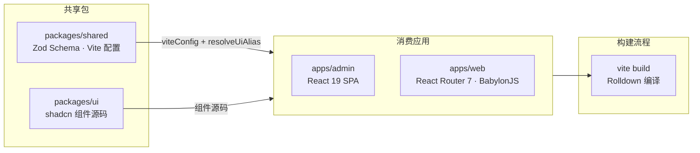

# 共享包体系

## 概述

EcoCtrl Monorepo 包含两个共享 package：`@ecoctrl/ui`（组件库）和 `@ecoctrl/shared`（工具库）。两者均采用**源码分发**模式 — 不经过独立构建步骤，在消费者 App 的编译流水线中直接编译。这种设计避免了双重编译问题，减少了构建步骤的开销。

## @ecoctrl/ui — 组件库

### 定位

`@ecoctrl/ui` 是基于 shadcn/ui 的组件库，提供 Admin 和 Web 前端共享的 UI 组件。组件采用 TailwindCSS v4 样式，遵循 shadcn 的设计体系（基于 Radix UI 原语）。

### 源码分发模式

消费者 App（admin、web）通过 TypeScript 路径映射直接引用 `.tsx` 源码，在各自的 `vp build`（Rolldown）过程中一并编译。`packages/ui/` 目录本身不运行任何构建命令。

分发路径：

```text
consumer (admin / web)
    │  import { Button } from "@ecoctrl/ui/button"
    │
    ▼
TypeScript / Rolldown 解析
    │
    ▼
packages/ui/src/components/ui/button.tsx  ← 直接编译源码
```

### Subpath Export 与 generate-proxies

组件通过 `package.json` 的 `exports` 字段定义子路径导出：

```json
{
  "exports": {
    ".": "./src/index.ts",
    "./button": "./src/components/ui/button.tsx",
    "./card": "./src/components/ui/card.tsx",
    "./scroll-area": "./src/components/ui/scroll-area.tsx"
    // 每个 UI 组件自动注册一条子路径导出
  }
}
```

新增组件后需要运行 `pnpm generate-proxies`。该脚本扫描 `src/components/ui/` 下的所有 `.tsx` 文件，自动更新 `package.json` 的 exports 字段和 TypeScript 类型声明。

### 组件清单

`@ecoctrl/ui` 包含标准 shadcn 组件（持续扩展中）：

| 组件       | 文件路径                            | 依赖             |
| ---------- | ----------------------------------- | ---------------- |
| Button     | `src/components/ui/button.tsx`      | Radix Slot       |
| Card       | `src/components/ui/card.tsx`        | —                |
| ScrollArea | `src/components/ui/scroll-area.tsx` | Radix ScrollArea |
| Input      | `src/components/ui/input.tsx`       | —                |
| Select     | `src/components/ui/select.tsx`      | Radix Select     |
| Table      | `src/components/ui/table.tsx`       | —                |
| Dialog     | `src/components/ui/dialog.tsx`      | Radix Dialog     |
| Dropdown   | `src/components/ui/dropdown.tsx`    | Radix Dropdown   |
| Toast      | `src/components/ui/toast.tsx`       | Sonner           |
| Sheet      | `src/components/ui/sheet.tsx`       | Radix Sheet      |
| Tooltip    | `src/components/ui/tooltip.tsx`     | Radix Tooltip    |
| Badge      | `src/components/ui/badge.tsx`       | —                |
| Avatar     | `src/components/ui/avatar.tsx`      | Radix Avatar     |
| Switch     | `src/components/ui/switch.tsx`      | Radix Switch     |
| Tabs       | `src/components/ui/tabs.tsx`        | Radix Tabs       |
| Skeleton   | `src/components/ui/skeleton.tsx`    | —                |

### TailwindCSS 配置

`@ecoctrl/ui` 的样式依赖 TailwindCSS 预设。消费者 App 在其 `tailwind.config.ts` 中引用 `@ecoctrl/ui` 的样式源路径：

```typescript
// consumer 的 tailwind.config.ts
export default {
  content: [
    "./src/**/*.{ts,tsx}",
    "../packages/ui/src/**/*.{ts,tsx}", // 包含 UI 包源码
  ],
  // ...
};
```

## @ecoctrl/shared — 工具库

`@ecoctrl/shared` 提供三部分能力，供前后端共同使用。

### 1. Zod Schema

跨前后端共享的数据结构定义，位于 `packages/shared/types/api/`：

- **用户相关**：`UserPreferences`、`UserProfile`、`LoginRequest`、`LoginResponse`
- **3D 场景相关**：`DashboardModelConfig`（场景配置）、`DashboardModelLabel`（标签）、`LabelAction`（标签行为）
- **能耗相关**：`EnergyReading`、`EnergyArea`、`EnergyStats`
- **运维相关**：`Alert`、`MaintenanceTask`、`FaultRecord`
- **API 通用**：分页参数 `PaginationParams`、分页响应 `PaginatedResponse<T>`

这些 Zod Schema 在服务端通过 `fastify-type-provider-zod` 驱动路由校验，前端则用于类型推导和数据验证：

```typescript
// 服务端使用
import { LoginRequest } from "@ecoctrl/shared";

server.post(
  "/auth/login",
  {
    schema: { body: LoginRequest },
  },
  handler,
);

// 前端使用
import { LoginRequest } from "@ecoctrl/shared";
type LoginFormData = z.infer<typeof LoginRequest>;
```

同一份 Schema 同时驱动 OpenAPI 文档生成（通过 `@fastify/swagger` 从 Zod Schema 自动提取），确保文档与实现始终同步。

### 2. Vite 配置工具（viteConfig）

`viteConfig` 是统一的 Vite 配置基座，所有 App 的 `vite.config.ts` 继承此配置：

```typescript
// apps/admin/vite.config.ts
import { viteConfig } from "@ecoctrl/shared";

export default viteConfig({
  // App 专属覆盖或扩展
  plugins: [myCustomPlugin],
});
```

基座配置包含：

- React 插件配置（@vitejs/plugin-react）
- TypeScript 路径别名映射（resolveUiAlias）
- TailwindCSS 插件配置
- 公共构建优化（压缩、分块策略）
- 开发服务器端口规范

### 3. resolveUiAlias — 别名解析插件

`resolveUiAlias()` 是一个 Vite 插件工厂函数，用于将 `@ecoctrl/ui/<component>` 的导入路径解析到源码的准确位置：

```typescript
import { resolveUiAlias } from "@ecoctrl/shared";

// 在 vite.config.ts 中注册
export default defineConfig({
  resolve: {
    alias: [resolveUiAlias()],
  },
});
```

插件内部逻辑：

```text
1. 检测导入源是否为 @ecoctrl/ui/
2. 是 → 将路径映射到 <monorepo-root>/packages/ui/src/
3. 处理 TypeScript 路径别名以匹配
4. 返回解析后的绝对路径
```

若消费者 App 未注册 `resolveUiAlias()`，Vite 将无法解析 `@ecoctrl/ui/*` 导入，编译时会抛出模块未找到错误。

## 包依赖图



`packages/server` 不依赖 `@ecoctrl/ui` 或 `@ecoctrl/shared` — 它是独立的 Node.js Fastify 应用，拥有自己的依赖树。

## 新增组件工作流

向 `@ecoctrl/ui` 添加新 shadcn 组件的完整流程：

```text
1. 确认当前目录为 monorepo 根目录或 packages/ui 目录
2. 运行: pnpm dlx shadcn@latest add <component> -y
   - 自动下载组件源码到 packages/ui/src/components/ui/<component>.tsx
   - 自动添加组件依赖（Radix UI 包等）
3. 运行: pnpm generate-proxies
   - 扫描 src/components/ui/ 目录
   - 更新 package.json 的 exports 字段添加新子路径
   - 更新 TypeScript 类型声明
4. 在消费者 App 中导入使用:
   import { Button } from "@ecoctrl/ui/button"
```

## 构建行为总结

| 包                | 是否独立构建 | 原因                                                                                                |
| ----------------- | ------------ | --------------------------------------------------------------------------------------------------- |
| `@ecoctrl/ui`     | 否           | 源码分发，消费者 App 编译时直接包含 `.tsx` 源文件                                                   |
| `@ecoctrl/shared` | 否           | 部分为纯 TypeScript 类型，部分为 Zod Schema（消费者端编译时包含）；服务端通过 rollup 打包时一并编译 |
| consumer apps     | 是           | `vp build` 打包所有依赖（包括 shared packages 源码）为独立 bundle                                   |
