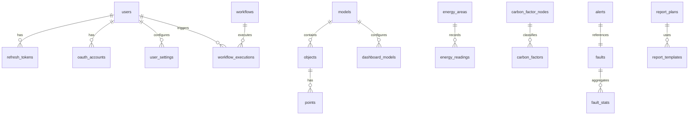

# 实体关系图 (ERD)

## 核心表关系

## 键的外键关系

| 源表                | 外键       | 目标表                 | 级联删除 |
| ------------------- | ---------- | ---------------------- | -------- |
| refresh_tokens      | userId     | users.id               | CASCADE  |
| oauth_accounts      | userId     | users.id               | CASCADE  |
| objects             | modelId    | models.id              | CASCADE  |
| points              | objectId   | objects.id             | CASCADE  |
| energy_readings     | areaId     | energy_areas.id        | RESTRICT |
| carbon_factors      | nodeId     | carbon_factor_nodes.id | CASCADE  |
| workflow_executions | workflowId | workflows.id           | CASCADE  |
| dashboard_models    | modelId    | models.id              | CASCADE  |

## 索引策略

| 表                  | 索引字段                 | 目的                   |
| ------------------- | ------------------------ | ---------------------- |
| refresh_tokens      | tokenHash (unique)       | 快速查找 Refresh Token |
| refresh_tokens      | userId                   | 按用户查询活跃会话     |
| users               | username (unique), email | 登录加速               |
| energy_readings     | (areaId, recordedAt)     | 区域能耗时序查询       |
| faults              | status, level            | 告警列表快速筛选       |
| workflow_executions | workflowId, startedAt    | 执行记录查询排序       |

<!-- Mermaid ERD 图见上方 -->
